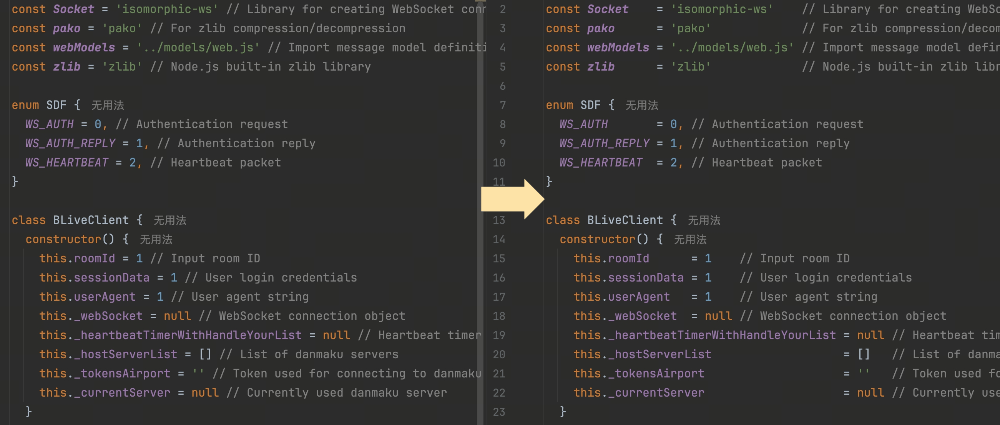

# prettier-plugin-verticalize

这是一个 Prettier v3+ 插件，用于对代码中的变量声明、枚举属性、赋值表达式等进行**垂直对齐**。

目前支持的对齐：

- 变量声明
- 枚举值
- 赋值表达式
- 行尾注释

> ⚠️ 本插件依赖等宽字体才能正确显示对齐效果。请确保编辑器使用的是等宽（monospace）字体，例如 Fira Code, JetBrains Mono,
> Consolas, Monaco 等。

## 效果预览



## 安装

```bash
npm install -D prettier prettier-plugin-verticalize
```

需要 Prettier 3.x。

## 启用

在 Prettier 配置文件（prettier.config.js、prettier.config.cjs 或 .prettierrc）中注册插件。

```js
// prettier.config.js
import prettierPluginVerticalize from 'prettier-plugin-verticalize'
export default {
  plugins: [prettierPluginVerticalize],
}
```

```js
// prettier.config.cjs
module.exports = {
  plugins: [require('prettier-plugin-verticalize')],
}
```

```json
// .prettierrc
{
  "plugins": ["prettier-plugin-verticalize"]
}
```

## 配置选项

| 选项                                   | 类型      | 默认值 | 说明                          |
| -------------------------------------- | --------- | ------ | ----------------------------- |
| `minGroupSize`                         | `number`  | `2`    | 最少几条语句视为一组进行对齐  |
| `maxWidthDiff`                         | `number`  | `20`   | 组内语句之间最大宽度差异      |
| `alignTrailingComments`                | `boolean` | `true` | 是否启用行尾注释对齐          |
| `alignEnums`                           | `boolean` | `true` | 是否启用枚举对齐              |
| `alignVariableDeclaration`             | `boolean` | `true` | 是否启用变量声明对齐          |
| `alignAssignment`                      | `boolean` | `true` | 是否启用赋值语句对齐          |
| `alignTrailingCommentsMinGroupSize`    | `number`  | -      | 单独设置行尾注释 minGroupSize |
| `alignTrailingCommentsMaxWidthDiff`    | `number`  | -      | 单独设置行尾注释 maxWidthDiff |
| `alignEnumsMinGroupSize`               | `number`  | -      | 单独设置枚举 minGroupSize     |
| `alignEnumsMaxWidthDiff`               | `number`  | -      | 单独设置枚举 maxWidthDiff     |
| `alignVariableDeclarationMinGroupSize` | `number`  | -      | 单独设置变量声明 minGroupSize |
| `alignVariableDeclarationMaxWidthDiff` | `number`  | -      | 单独设置变量声明 maxWidthDiff |
| `alignAssignmentMinGroupSize`          | `number`  | -      | 单独设置赋值语句 minGroupSize |
| `alignAssignmentMaxWidthDiff`          | `number`  | -      | 单独设置赋值语句 maxWidthDiff |

### minGroupSize

```javascript
// 当 `minGroupSize` 设置为 3 时，少于 3 行，不对齐
const name = 'rio'
const age = 18

// 当 `minGroupSize` 设置为 3 时，大于等于 3 行，对齐
const foo       = 1
const barz      = 2
const component = 3
```

### maxWidthDiff

```javascript
// 当 `maxWidthDiff` 设置为 20 时
console.log('1234')       // 注释前长度差距为6
console.log('1234567890') // 注释前长度差距为6

const number1234       = 1 
const number1234567890 = 1

// 当 `maxWidthDiff` 设置为 5 时
console.log('1234') // 注释前长度差距为6
console.log('1234567890') // 注释前长度差距为6

const number1234 = 1
const number1234567890 = 1
```
